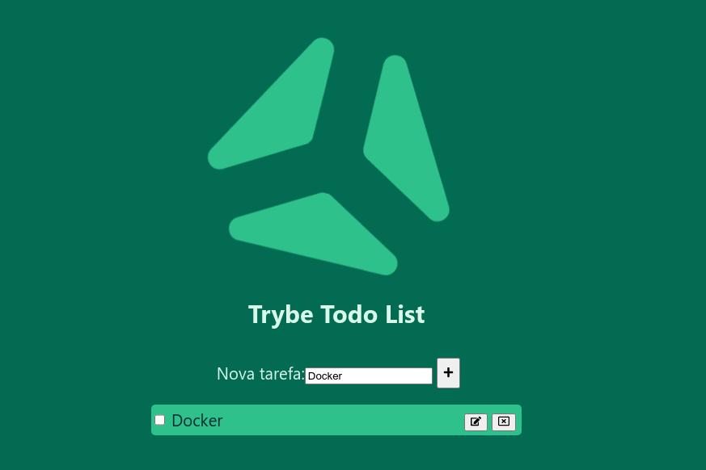

# Dockerized To-Do List

This is a project to dockerize a To-Do list, the application was delivered by Trybe to dockerize. The application is a To-Do list, where you can add, edit and delete tasks.

---

## 

---

## Requirements

- [Docker](https://www.docker.com/)
- [Docker Compose](https://docs.docker.com/compose/)

---

## How to use

1. Clone this repository:

- `git clone git@github.com:lucasdximenes/dockerized-todo-list.git`

2. Go to the project folder:

- `cd dockerized-todo-list`

3. Run the docker-compose:

- `docker-compose up -d`

4. Access the application:

- `http://localhost:3000`

---

## How to stop

1. Stop the docker-compose:

- `docker-compose down`

---

## The tests

- look at the [docker-compose.yml](docker-compose.yml) file

---

## Author

- [Lucas Ximenes](https://www.linkedin.com/in/lucasdximenes)

---
